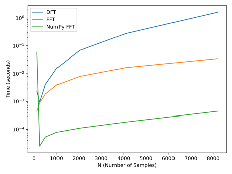
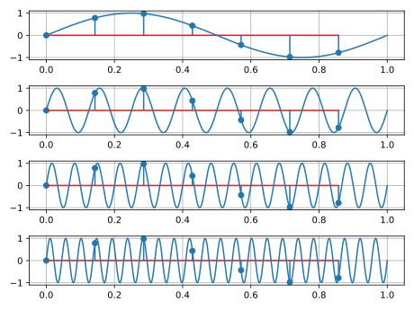
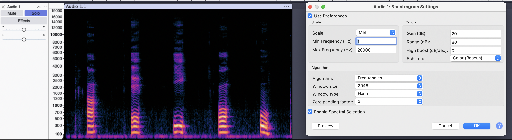
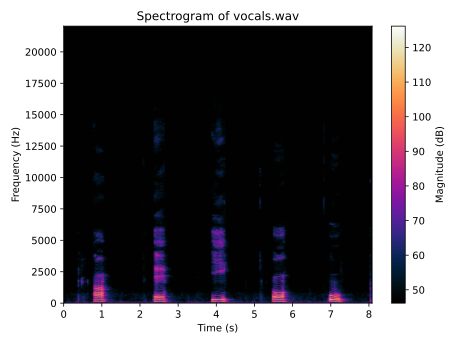

# Signal Processing Lab 4

## Ex 1

## Ex 2

## Ex 3

## Ex 4

$$
    f_s > 2 \cdot f_{max} = 400 \text{Hz}
$$

## Ex 5

### Audacity

### Manual

> [!NOTE]  
> Audacity folosește scară Mel, ceea ce nu este prezent în `matplotlib`, așa că am folosit scară liniară.

## Ex 7

$$
\text{SNR} = \frac{P_{\text{semnal}}}{P_{\text{zgomot}}}
$$
$$
\text{SNR}_{\text{dB}} = P_{\text{semnal (dB)}} - P_{\text{zgomot (dB)}} = 10 \log_{10} \text{SNR}
$$

Deci, avem cå

$$
P_{\text{zgomot (dB)}} = 90 \text{dB} - 80 \text{dB} = 10 \text{dB}
$$

Deci,

$$
P_{\text{semnal}} = 10^{90 / 10} = 10^9
$$

$$
\frac{P_{\text{semnal}}}{P_{\text{zgomor}}} = 10^{\text{SNR}_\text{dB} / 10} = 10^8
$$

Deci $P_{\text{zgomot}} = \frac{10^9}{10^8} = 10 \text{ dB}$